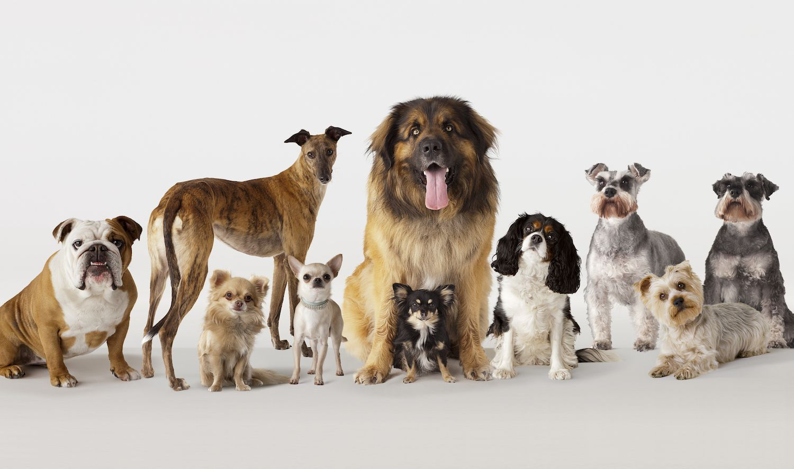
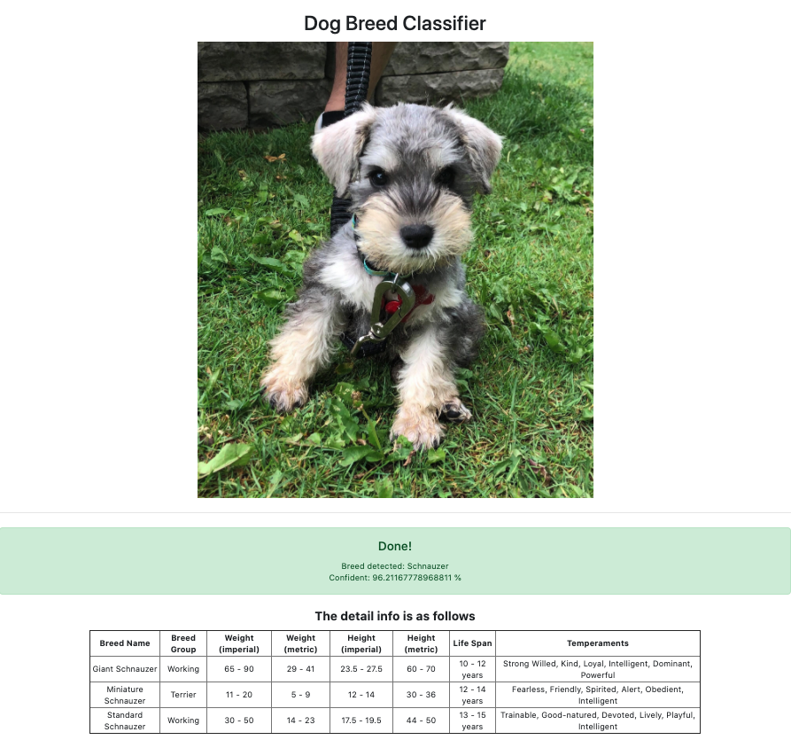
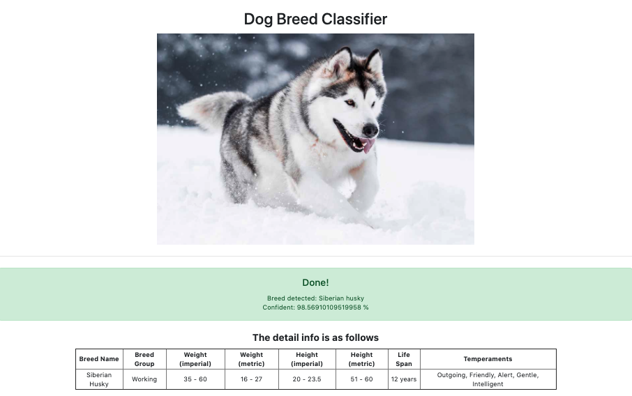

# Dog Breed Classifier

 <ins>[Click here](https://doggo-breed-classifier.herokuapp.com/index)</ins> to try

## About:
Ever seen a cute doggo on the street? And wonder what kind of dog is that?
SAY NO MORE, I got you! Just take a picture of that cutie, and let Dog Breed Classifier help you. Upload the image, sit back and ***voilà***, the detailed information of your cute dog is right in front of you!!

<p align="center">
    
</p>

## Demo

#### no.1
<p align="center">
    
    <small>My good boi: Max</small>
</p>

#### no.2
<p align="center">
    
    <small>A Siberian Husky</small>
</p>


## Disclaimer:
> The result might not be accurate in some situations due to bias when filtering. 
In addition, labeling might identify another object if the background of the image is too overwhelming, or simply because there are too many subjects in the picture.
This project is mainly to demonstrate the potential of using Google Vision AI for image recognition.
As a result, this project should not be used in development.  

## Structure of the project:
+ `app.py` is the main Python file. It is used for processing, labeling, and filtering the input image as well as managing the Flask server.
+ `templates` directory contains 2 files: `index.html` and `result.html`, which are served by Flask.
+ `temp` was set to be the static directory for this project. It also serves as a temporary folder to store images for analyzing.
+ `temp/static_serving` is the directory contains the common resources between web pages (`functions.js`, `style.js`, and `defaultPreview.jpg`)
+ `blacklist.json` contains a list of keywords that should be exempted from the return data. For example, you don't want the app to recognize a special breed of Corgi ("Cardigan Welsh Corgi"), then add the name here.
+ `GCloud_credentials.json`: a unique private API credential from Google Vision, that can be obtained after following [Google Vision Docs](https://cloud.google.com/vision/docs)
+ `TheDogAPI.json`: contains a unique private API key, can be obtained free via [The Dog API](https://thedogapi.com/)

## Build Guide:
### Using Docker:
+ Build the image using `Dockerfile` in the project. Then run and access local host via `http://0.0.0.0:{$PORT}/`, the default value of `PORT` is 5000 in `Dockerfile`.

### Otherwise:
+ `pip install --no-cache-dir -r requirements.txt` to install dependencies (Alternatively, you can run in `pipenv`). 
+ Set up `GCloud_credentials.json` in the project. Consult [Google Cloud Vision setup page](https://cloud.google.com/vision/docs/setup) for detailed steps. 
+ Obtain an API key from [The Dog API](https://thedogapi.com/) and add the key to the file `TheDogAPI.json` in this format (substitute `YOUR_API_KEY` with the obtained API key):
```
{
    "x-api-key": "YOUR_API_KEY"
}
```
+ Set up os environment manually in `app.py` for:
    + `BLACKLIST`
    + `GOOGLE_APPLICATION_CREDENTIALS`
    + `DOG_API_KEY`
    + `PORT` 
    according to the relative paths in your machine.

+ `python app.py` or `python3 app.py` to start the Flask server
+ Go to `http://0.0.0.0:PORT/` (PORT is the value you set) to see the result.

## Dependencies:
+ For the full list of dependencies in the project, consult `requirements.txt`

## Acknowledgment:
+ [Google Cloud Vision](https://cloud.google.com/)
+ [The Dog API](https://thedogapi.com/)